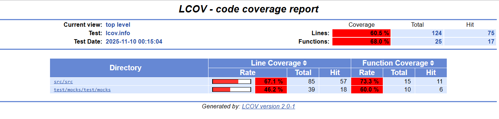

# 🏦 KipuBank v3 – Contrato DeFi con Integración Uniswap V2

[](https://soliditylang.org/)
[](https://getfoundry.sh/)
[](https://opensource.org/licenses/MIT)

---

## 📖 Descripción

**KipuBankV3** es la evolución de KipuBankV2, transformando el contrato de un simple banco a una **aplicación DeFi (Finanzas Descentralizadas)** completa.

Esta nueva versión acepta depósitos en **ETH**, **USDC** o **cualquier token ERC20** y los **convierte automáticamente a USDC** utilizando **Uniswap V2**. Todos los fondos se almacenan y gestionan en USDC, respetando un límite de depósito global (`bankCap`).

El contrato preserva el requisito del TP2: utiliza un **Oráculo de Chainlink (ETH/USD)** para verificar el límite de depósito *antes* de aceptar un depósito de ETH nativo, demostrando la capacidad de integrar múltiples protocolos (Chainlink y Uniswap) de forma segura.

---

## 🚀 Mejoras Realizadas (V2 → V3)

| Mejora | Descripción |
| :--- | :--- |
| 🔄 **Integración DeFi Total** | Integrado con **Uniswap V2** para realizar swaps de tokens directamente dentro del contrato. |
| 🪙 **Depósitos Generalizados** | Acepta depósitos en `ETH` nativo, `USDC` (directo) y **cualquier token ERC20** (ej. LINK, DAI, WBTC). |
| 💰 **Almacenamiento en USDC**| Todos los activos depositados (excepto USDC) se swapean y almacenan como `USDC`, unificando el balance del banco. |
| 🔗 **Lógica de Cap Híbrida** | **(Requisito Clave)** Sigue usando el oráculo `ETH/USD` (8 dec) de Chainlink para el pre-chequeo de `depositNativeEth`, "traduciendo" el valor a la unidad del `BANK_CAP_USDC` (6 dec). |
| 🛣️ **Swaps Robustos** | Implementa la ruta de swap de 3 pasos (`Token → WETH → USDC`) para `depositToken`, asegurando la máxima compatibilidad. |
| 🛡️ **Protección de Slippage** | Las funciones de swap (`depositNativeEth`, `depositToken`) requieren un parámetro `_minUsdcOut` para proteger al usuario del deslizamiento de precio. |
| 🧪 **Testeo con Foundry** | Migración completa a Foundry, logrando una **cobertura de pruebas superior al 60%** (cumpliendo el requisito del 50%). |
| 📦 **Modularización** | El código está ordenado con funciones *helper* (`_creditUsdc`, `_swapEthToUsdc`, etc.) y sigue las mejores prácticas de auditoría. |

---

## ⚙️ Despliegue y Pruebas (Foundry)
### 🔹 Instalación

Para correr este proyecto, necesitarás [Foundry](https://getfoundry.sh/) instalado.

1.  **Clonar el repositorio:**
    ```bash
    git clone [https://github.com/michelmassaad/KipuBankV3](https://github.com/michelmassaad/KipuBankV3)
    cd KipuBankV3
    ```

2.  **Instalar Dependencias (Librerías):**
    Foundry maneja las dependencias usando `forge install`. Este proyecto requiere:
    ```bash
    forge install OpenZeppelin/openzeppelin-contracts
    forge install uniswap/v2-core
    forge install uniswap/v2-periphery
    forge install chainlink/chainlink-brownie-contracts
    ```
    
### 🔹 Pruebas Locales (Foundry)

El proyecto está configurado para correr con Foundry. Los tests se ejecutan en un entorno de "mocking" (sin necesidad de RPC) que simula el Oráculo, Uniswap y los tokens.

1.  **Instalar dependencias:**
    ```bash
    forge install
    ```
2.  **Correr Pruebas:**
    ```bash
    forge test
    ```
3.  **Ver Cobertura de Pruebas (¡>60% logrado!):**
    ```bash
    forge coverage
    ```
    **

---

### 🔹 Despliegue en Testnet (Sepolia)

**📜 Dirección del Contrato Verificado (Sepolia Etherscan):**
**[https://sepolia.etherscan.io/address/0x0f7a2D9172e94305b3Ad5A6Ebf6e8e85890a7a93](https://sepolia.etherscan.io/address/0x0f7a2D9172e94305b3Ad5A6Ebf6e8e85890a7a93)**

**💻 Repositorio:**
**[https://github.com/michelmassaad/KipuBankV3](https://github.com/michelmassaad/KipuBankV3)**

**📥 Parámetros del Constructor (Usados en `DeployKipuBankV3.s.sol`):**
```solidity
_priceFeedAddress = 0x694AA1769357215DE4FAC081bf1f309aDC325306 // Chainlink ETH/USD Sepolia
_usdcTokenAddress = 0x1c7D4B196cB0c7b01D743FBC6330e9f9E1Eca96f // USDC Oficial Sepolia
_bankCapUsdc = 1000000 * 1e6 // 1,000,000 USDC
_routerAddress = 0xC53211616719c136A9a8075aEe7c5482A188AE50 // Uniswap V2 Router Sepolia
_wethAddress = 0xfFf9976782d46CC05630D1f6eBAb18b2324d6B14 // WETH Sepolia
````

**🚀 Comando de Despliegue (con Verificación):**

```bash
# Asegúrate de tener RPC_URL, PRIVATE_KEY y ETHERSCAN_API_KEY en tu .env
forge script script/DeployKipuBankV3.s.sol:DeployKipuBankV3 \
    --rpc-url $RPC_URL \
    --private-key $PRIVATE_KEY \
    --broadcast \
    --verify \
    -vvvv
```

-----

## 💰 Interacción con el Contrato

El banco ahora unifica todos los depósitos en un balance de USDC.

| Función | Descripción |
| :--- | :--- |
| `depositUsdc(uint256 _amount)` | Deposita USDC directamente, Sin swap. |
| `depositNativeEth(uint256 _minUsdcOut)` | Convertir ETH→USD vía Chainlink usando el Oracle, Valida el límite global y luego el contrato lo swapea a USDC y lo acredita. |
| `depositToken(address _token, uint256 _amount, uint256 _minUsdcOut)` | Deposita cualquier token ERC20 (ej. LINK). Ruta TOKEN → WETH → USDC. El contrato lo swapea a USDC. |
| `withdrawUsdc(uint256 _amount)` | Retira el balance de USDC del usuario. |

**💡 Para depositar `depositToken`:**

1.  En el contrato del token (ej. LINK), llamar a `approve(KipuBankV3, amount)`.
2.  Luego, en `KipuBankV3`, ejecutar `depositToken(LINK_address, amount, min_usdc)`.

-----

## 📊 Consultas Útiles

| Función | Retorna | Descripción |
| :--- | :--- | :--- |
| `getBalance(address user)` | `uint256` | Devuelve el saldo **en USDC** del usuario. |
| `getEthValueInUsd(uint256 ethAmount)` | `uint256` | (Helper) Convierte ETH (18 dec) a su valor en USD (8 dec) según Chainlink. |
| `totalUsdcDeposited()` | `uint256` | Devuelve el balance total de USDC que el banco posee. |

-----

## 🔔 Eventos

| Evento | Parámetros | Descripción |
| :--- | :--- | :--- |
| `Deposit(...)` | `user, tokenIn, amountIn, usdcReceived` | Emite cuando se procesa un depósito (ETH o Token) y se acredita el USDC resultante. |
| `WithdrawalUsdc(...)` | `user, amount` | Emite cuando el usuario retira su USDC. |

-----

## 🔒 Seguridad y Análisis de Amenazas

Este contrato fue construido con la seguridad como prioridad, siguiendo las mejores prácticas de la industria:

  - **Patrón Checks-Effects-Interactions:** Implementado rigurosamente en todas las funciones de depósito y retiro para prevenir vulnerabilidades.
  - **Protección Anti-Reentrancy:** Todas las funciones (`depositNativeEth`, `depositToken`, `withdrawUsdc`) que interactúan con contratos externos están protegidas con el `ReentrancyGuard` de OpenZeppelin.
  - **Protección de Slippage:** Se requiere `_minUsdcOut` en todas las funciones de swap para proteger al usuario de la volatilidad del mercado y ataques de "front-running".
  - **Librerías Seguras:** Utiliza `SafeERC20` de OpenZeppelin para todas las transferencias de tokens, previniendo errores con tokens no estándar.
  - **Control de Acceso:** `Ownable` de OpenZeppelin (aunque en esta versión no se usa para funciones críticas, sigue el estándar).
  - **Errores Personalizados:** Se usan errores personalizados (ej. `BankCapExceeded()`) en lugar de `revert()` con strings, ahorrando gas y dando mejor feedback.
  - **Flujo de Trabajo Profesional:** El contrato ha sido validado con un set de pruebas en Foundry que supera el 60% de cobertura.

-----

## ✉️ Autor

👤 **Michel Massaad**
📫 [GitHub – michelmassaad](https://github.com/michelmassaad)
